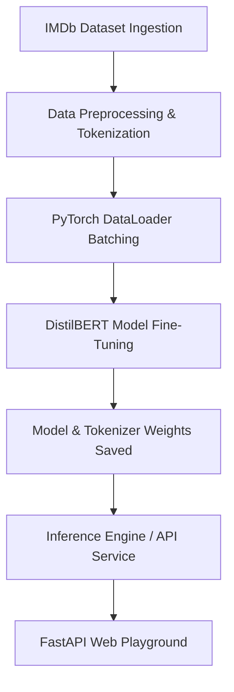

# End-to-End NLP Deep Learning Pipeline: Movie Review Sentiment Analysis

This repository demonstrates a complete, production-ready Natural Language Processing (NLP) pipeline for binary text classification (Sentiment Analysis). It transitions from interactive experimentation in a **Jupyter Notebook** to **production-grade modular Python scripts**, and finally deploys the model behind a **FastAPI backend** with a **premium glassmorphism web interface**.

The model is built using Hugging Face's `DistilBERT` architecture, trained with a native **PyTorch** optimization loop. This hybrid approach demonstrates a deep understanding of core deep learning mechanics (forward passes, loss computation, backpropagation) instead of relying on high-level trainer wrappers.

---

## Architecture & Pipeline Flow



---

## 📂 Repository Structure

```
NLP_classification_app/
├── notebooks/
│   └── sentiment_analysis.ipynb     # Interactive Jupyter Notebook pipeline
├── src/
│   ├── __init__.py                  # Package initializer
│   ├── config.py                    # Hyperparameters, hardware selection, and directory paths
│   ├── data_loader.py               # IMDb dataset loading and downsampling
│   ├── preprocessor.py              # Tokenization and PyTorch tensor conversion
│   ├── model.py                     # DistilBERT sequence classifier initialization
│   ├── train.py                     # Native PyTorch training loop
│   ├── evaluate.py                  # Test set evaluation pipeline
│   └── inference.py                 # Production sentiment prediction helper
├── run_pipeline.py                  # CLI script to execute the full pipeline
├── app.py                           # FastAPI web application backend
├── templates/
│   └── index.html                   # Premium Vanilla CSS/JS frontend interface
├── requirements.txt                 # Project dependencies
├── .gitignore                       # Ignored caches, environments, and model weights
└── README.md                        # Project documentation (this file)
```

---

## 🚀 Getting Started

### 1. Clone & Set Up Environment
First, ensure you have Python 3.8+ installed. Set up a virtual environment and install the dependencies:

```bash
# Create a virtual environment
python -m venv venv

# Activate it (Windows)
venv\Scripts\activate

# Activate it (macOS/Linux)
source venv/bin/activate

# Install requirements
pip install -r requirements.txt
```

### 2. Run the Full Pipeline (Train the Model)
Execute the pipeline orchestrator to load datasets, preprocess text, train the model on available hardware (CUDA, MPS, or CPU), evaluate testing accuracy, and save weights:

```bash
python run_pipeline.py
```

### 3. Launch the Web Application
Start the FastAPI server to query the model via an interactive web dashboard:

```bash
# Start uvicorn server
uvicorn app:app --reload
```

Once running, navigate to `http://127.0.5.1:8000` or `http://localhost:8000` in your web browser. 

> [!TIP]
> **No Model Trained Yet?** If you run `app.py` before running the training pipeline, the server will automatically fall back to downloading a standard pre-trained DistilBERT sentiment classifier from the Hugging Face hub, making the UI fully operational instantly!

### 4. Interactive Development
To step through the pipeline interactively, launch Jupyter Notebook:

```bash
jupyter notebook
```
Open `notebooks/sentiment_analysis.ipynb` and execute the steps.

---

##  Portfolio Optimization 

This project is structured specifically to showcase modern software engineering best practices within an ML project:

1. **Native PyTorch Loop**: In `src/train.py` and step 7 of the notebook, we write our own training loops instead of using the abstract Hugging Face `Trainer`. This proves we understand standard PyTorch optimization steps (`loss.backward()`, `optimizer.step()`, and `lr_scheduler.step()`).
2. **Modular Architecture**: Demonstrates how to write maintainable ML code by separating ingestion, tokenization, training, and production serving into separate, importable modules.
3. **Hardware-Aware Design**: Configured to auto-detect and run on **CUDA** (Nvidia GPUs), **MPS** (Apple Silicon GPUs), or fallback to **CPU**, ensuring high compatibility.
